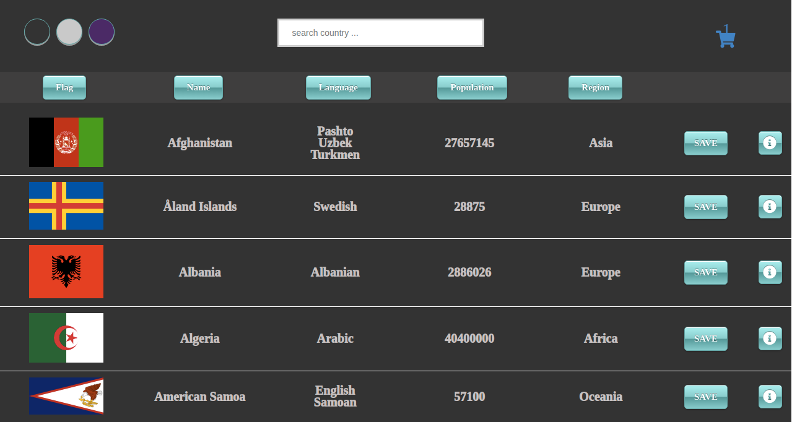
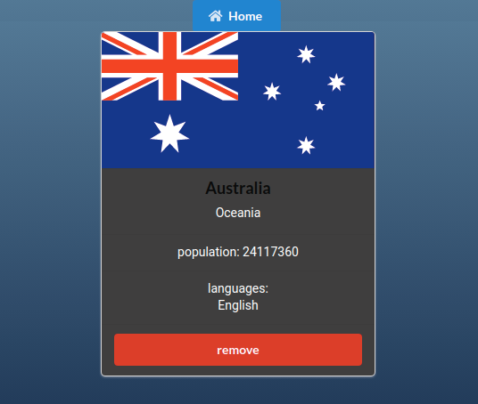

# Country App

> React-Redux frontend app

## Table of contents

-   [General info](#general-info)
-   [Screenshots](#screenshots)
-   [Technologies](#technologies)
-   [Setup](#setup)
-   [Features](#features)
-   [Status](#status)
-   [Inspiration](#inspiration)
-   [Contact](#contact)

## General info

The app uses open source API and allows user search, save and see detailed information about the preferred country.

## Screenshots

## Technologies

-   React.js
-   Redux
-   Semantic UI
-   Local Storage
-   GitHub Actions
-   Docker

## Setup

Feel free to clone the app, install with the command `npm install` or `yarn install ` and run `npm start` or `yarn run`

## Features

List of features ready and TODOs for future development

-   Search filter
-   Sorting
-   View single Country
-   Added Redux
-   Remove Country
-   Theme Switcher via Redux
-   Save in Local Storage

To-do list:

-   Responsive Design
-   Pagination
-   Add useContext

## Status

Project is: _in progress_

## Inspiration

Project is created for educational purposes

## Contact

Created by [Grigor Fanyan](https://www.linkedin.com/in/gregfanyan/) - feel free to contact me!
