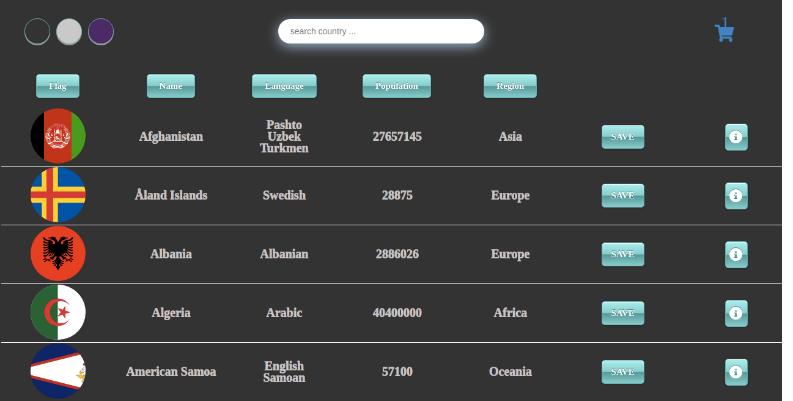

# Country App

> React-Redux frontend app

## Table of contents

-   [General info](#general-info)
-   [Screenshots](#screenshots)
-   [Technologies](#technologies)
-   [Setup](#setup)
-   [Features](#features)
-   [Status](#status)
-   [Inspiration](#inspiration)
-   [Contact](#contact)

## General info

A web-based application that fetches the data from an external API and features search,
filtering, changeable themes, responsiveness and a shopping cart function.

## Screenshots

## Technologies

-   React.js
-   Redux
-   Redux-Thunk
-   React-Router
-   Semantic UI
-   Local Storage
-   GitHub Actions
-   Docker
-   SCSS

## Setup

Feel free to clone the app, install with the command `npm install` or `yarn install ` and run `npm start` or `yarn run`

## Features

List of features ready and TODOs for future development

-   Search filter
-   Sorting
-   View single Country
-   Add to Cart
-   Remove Country
-   Theme Switcher
-   Save in Local Storage
-   Responsive Design
-   Pagination

## Status

Project is: Completed

## Inspiration

Project is created for educational purposes

## Contact

Created by [Grigor Fanyan](https://www.linkedin.com/in/gregfanyan/) - feel free to contact me!
